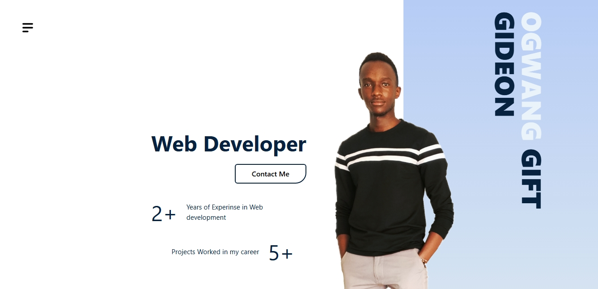

# Gideon Prime — Portfolio



A modern developer portfolio built with **Vite**, **React**, and **Tailwind CSS**.
Fast, lightweight, animated, and optimized for smooth interaction.

[Visit my site](https://iamgideon.vercel.app/)

---

## Getting Started

Install dependencies:

```bash
pnpm i
```

Run the development server:

```bash
pnpm dev
```

---

## Tech Stack & Packages

### Core

* **Tailwind CSS** — Utility-first styling
  [https://tailwindcss.com/docs/installation](https://tailwindcss.com/docs/installation)
* **Vite** — Fast build tool
  [https://vitejs.dev/guide/](https://vitejs.dev/guide/)

### UI / UX Enhancements

* **Swiper.js** — Sliders & carousels
  [https://swiperjs.com/get-started](https://swiperjs.com/get-started)
* **AOS (Animate On Scroll)** — Scroll animations
  [https://michalsnik.github.io/aos/](https://michalsnik.github.io/aos/)
* **React Modal** — Accessible modal components
  [https://www.npmjs.com/package/react-modal](https://www.npmjs.com/package/react-modal)
* **React Icons** — Icon library
  [https://react-icons.github.io/react-icons/](https://react-icons.github.io/react-icons/)

### Utilities

* **EmailJS** — Email sending from client-side
  [https://www.emailjs.com/docs/](https://www.emailjs.com/docs/)
* **react-hot-toast** — Toast notifications
  [https://react-hot-toast.com/docs](https://react-hot-toast.com/docs)
* **react-helmet** — Manage document head
  [https://www.npmjs.com/package/react-helmet](https://www.npmjs.com/package/react-helmet)

---

Feel free to plug in additional sections like deployment, environment variables, or contribution guidelines whenever you’re ready.
